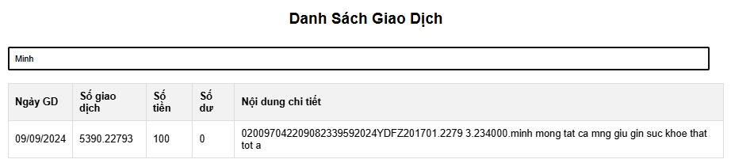

# account-statement

# Project: Account Statement of MAT TRAN TO QUOC VN - BAN CUU TRO TW Vietcombank supports storm victims of typhoon Yagi
## Overview
This project extracts transaction data from a PDF file, converts it into a structured CSV format, and reads the data for analysis or search purposes. The script handles transactions with specific data patterns, saves them as CSV, and provides a way to search through the parsed data.

### Features
- Extracts transaction data from PDF files.
- Converts the extracted data into a CSV file.
- Reads CSV files and loads transaction data into objects.
- Search functionality to filter transactions based on user input.

### Prerequisites
Ensure that you have the following installed:

- Python 3.7 or higher
- Required Python packages: PyPDF2, csv, re, pathlib, typing

### Installation
1. Clone the repository or download the source code.
2. Ensure the required packages are installed by running:
    pip install PyPDF2

### File Structure
- main_script.py: The main Python script containing all functions and logic.
- input.pdf: The PDF file from which data will be extracted (should be in the same directory).
- output.csv: The output CSV file generated after parsing the PDF.
- README.md: Documentation for the project.

### Usage
1. Place your input.pdf in the same directory as main_script.py.
2. Run the script using the command:
    python main_script.py
3. If output.csv already exists, it will read data directly from the CSV. If not, the script will generate it by parsing input.pdf.
4. The script will load the data, and you can search for transactions by entering keywords when prompted:
    Please enter search word: <keyword>
    
```javascript I'm tab B
console.log('Code Tab B');
```
### How It Works

- PDF Parsing: The script reads the content of the provided PDF and splits the text based on specific patterns, isolating transaction data.
- Data Conversion: Extracted data is processed and written into a CSV file with relevant columns such as Date, Transaction ID, Amount, and Details.
- Search Capability: Once the data is loaded, users can search for transactions by entering any keyword related to the amount or transaction details.

### Code Explanation

- Transaction Class: A class to create transaction objects for better data handling.
- pdf_to_csv(): Extracts data from the PDF and writes it into a CSV file.
- read_data_file(): Reads data from an existing CSV file and loads it into transaction objects.
- split_transactions(): Splits raw data from the PDF into individual transactions based on a date pattern.
- remove_using_pop(): Utility to remove header data lines.
- Search Functionality: Filters loaded transactions based on user input for easy querying.


## Demo
### Display all transaction information

<p align="center">
  
</p>


### Search for transaction information

<p align="center">
  
</p>

### Statistics by day

<p align="center">
  
</p>


